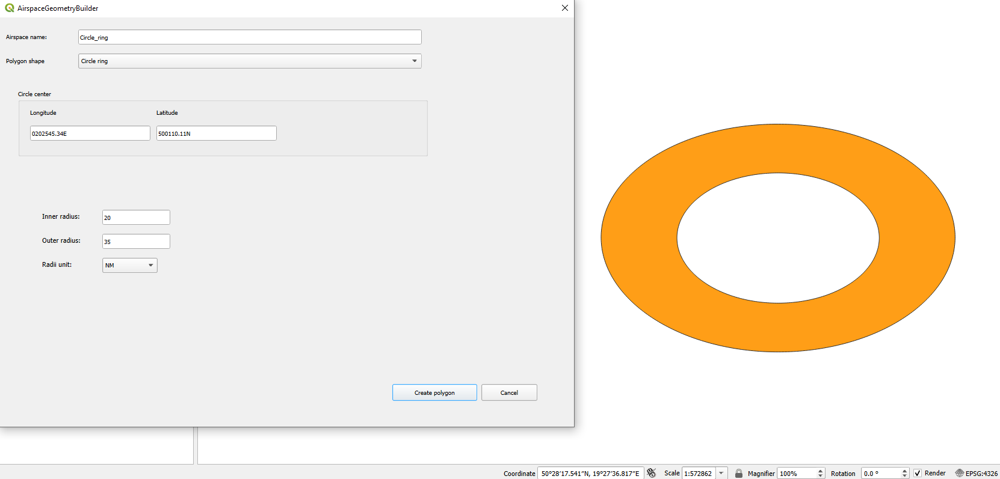

# AirspaceGeometryBuilder

QGIS Plugin to create airspace geometries that are defined as in aviation publications such as Aeronautical Information Publication (AIP), Notice To Air Missions (NOTAM), e.g:
* circle: center longitude, latitude and radius
* circle sector: center longitude, latitude, radius, true bearings (from, to)
* clockwise, anti-clockwise arc lines, strait lines between points defined by true bearing and distance from arc centre

- [Installation](#installation)
  - [For Git users](#git_user)
  - [For no Git users](#no_git_user)
- [Usage](#usage)
  - [Open plugin](#open_plugin)
  - [Supported coordinates/azimuth formats](#supported_formats)
  - [Output](#output)
  - [Crating geometries](#creating_geometries)
    - [Circle](#circle)
    - [Circle sector](#circle_sector)
    - [Circle ring](#circle_ring)
    - [Circle segment](#circle_segment)
    - [Circle ring sector](#circle_ring_sector)

# Installation <a name=installation>

## For Git users <a name=git_user>

1. Copy repository to the local disk
2. cd dir to the main dir of the `qgis3-airspace-geometry-builder` repository
3. Create zip file from the `airspace_geometry_builder` subdirectory
4. QGIS - install plugin via Plugin manager/Installer  
   4.1 Open menu: `Plugins > Manage and Install Plugins`  
   4.2 Choose `Install from ZIP`  
   4.3 Select zip file `airspace_geometry_builder.zip`  
   4.4 Press `Install Plugin button` 
5. Plugin is installed: `Plugins > AirspaceGeometryBuilder`

## For no Git users <a name=no_git_user>

1. Download repository via `Code > Download ZIP`
2. Unzip to `qgis3-airspace-geometry-builder` directory
3. cd dir to the unzipped directory
4. Create zip file from the `airspace_geometry_builder` subdirectory
5. QGIS - install plugin via Plugin manager/Installer  
   5.1 Open menu: `Plugins > Manage and Install Plugins`   
   5.2 Choose `Install from ZIP`  
   5.3 Select zip `airspace_geometry_builder.zipp`  
   5.4 Press `Install Plugin button`  
6. Plugin is installed: `Plugins > AirspaceGeometryBuilder`

# Usage <a name=usage>

## Open plugin <a name=open_plugin>

1. Select polygon/multipolygon for which you want to add nodes labels with DMS
2. Open plugin: `Plugins > AirspaceGeometryBuilder`
3. Enter `Airspace Name`
4. Choose `Polygon Shape`
5. Enter value that defined Polygon Shape (circle center, bearings etc.)
6. Press `Create Polygon` button

## Supported coordinates/azimuth formats <a name=supported_formats>

Notes:
* supported CRS: WGS84 (EPSG:4326)
* leading zero is required for degrees, minutes, seconds coordinates and bearings: example 0100503.4E instead of 100503.4E
* bearing values are true bearing
* distances: meters, kilometers, nautical miles, feet

* coordinates:
  * DMSH, HDMS compacted, e.g: 0203544.5E, N500110.1
  * DMH, HDM compacted, e.g.: E02035.5, N5020.9
* true bearing:
  * DMS compacted: 0105030.5
  * DM compacted: 01050.5

## Output <a name=output>

* geometries are added to the temporary scratch layer created by plugin
* name of the layer: 
  * follows convention: `AspGeometryBuilder_<timestamp>`
  * timestamp is time of creating layer in the format: `<Year>_<Month>_<HourMinuteSecondMicrosecond as a decimal number, zero-padded to 6 digits>`
  * e.g.: AspGeometryBuilder_2025_02_16_1219879486
* attribute fields:

| Field name  | Type |Length|
| ----------- |------|------|
| FEAT_NAME    | Text | 100 |

## Creating geometries <a name=creating_geometries>

### Circle <a name=circle>

Example of airspace definition:
```
Area within a radius of 1 NM centered at (1230N 0763750E)
```


Example of airspace definition:
```
LATERAL LIMITS:
CIRCLE RADIUS 6NM AT CENTERED DEFINED AS POINT: 10 NM FROM 515006N 0163119E AT TRUE BEARING 50 DEGREES
```


### Circle sector <a name=circle_sector>

Example of airspace definition:

```
Coordinates of launching pad 242432N 0865851E.
A sector with radius of 10NM from the launch pad between azimuth angles of 100 to 190.
```


### Circle ring <a name=circle_ring>

Example of airspace definition:

```
Area defined as between riadus 20NM and 35NM from point 202545.34E 500110.11N
```



### Circle segment <a name=circle_segment>

Example of airspace definition:
```
Area defined as: Starting at point 10 NM at true bearing 26 from point 342432N 0865851E, then clockwise along arc with center at 
point 342432N 0865851E and radius 10 NM to point 10 NM at true bearing 126 from point 342432N 0865851E, then strai line to the begining.
```


### Circle ring sector <a name=circle_ring_sector>

Example of airspace definition:
```
Coordinates of launching pad 242432N 0865851E.
A circle ring between radius 40NM and 100NM from launch pad between azimuth angles 50 and 120 
```
